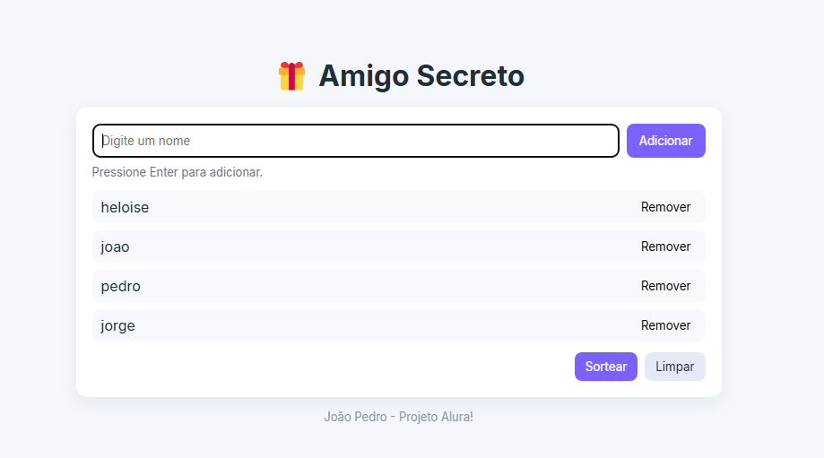
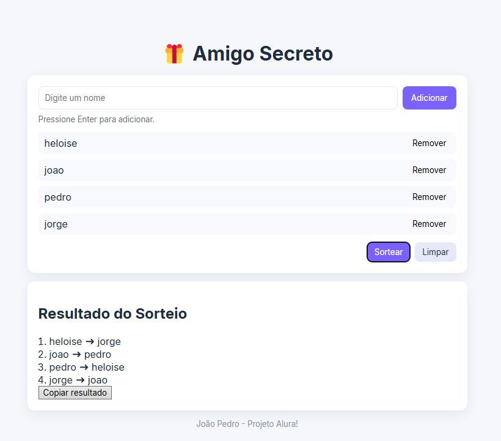

# 🎁 Amigo Secreto

Aplicativo simples para organizar sorteios de **Amigo Secreto**. Este repositório contém uma versão funcional em HTML/CSS/JavaScript que permite adicionar participantes, remover nomes, e realizar o sorteio garantindo que ninguém tire a si mesmo.

## Funcionalidades
- Adicionar participantes (validação contra nomes vazios e duplicados).
- Remover participantes da lista.
- Realizar sorteio automático evitando que alguém tire a si próprio.
- Copiar resultado para a área de transferência.
- Interface responsiva e simples.

## Como usar localmente
1. Clone ou faça download deste repositório.
2. Abra o arquivo `index.html` no navegador (ou execute via servidor local).
3. Adicione nomes e clique em **Sortear** quando quiser ver os resultados.

## Estrutura do projeto
```
amigo-secreto/
├─ index.html
├─ style.css
├─ script.js
└─ docs/
   ├─ exemplo1.png
   └─ exemplo2.png
```

## Capturas de tela



---

